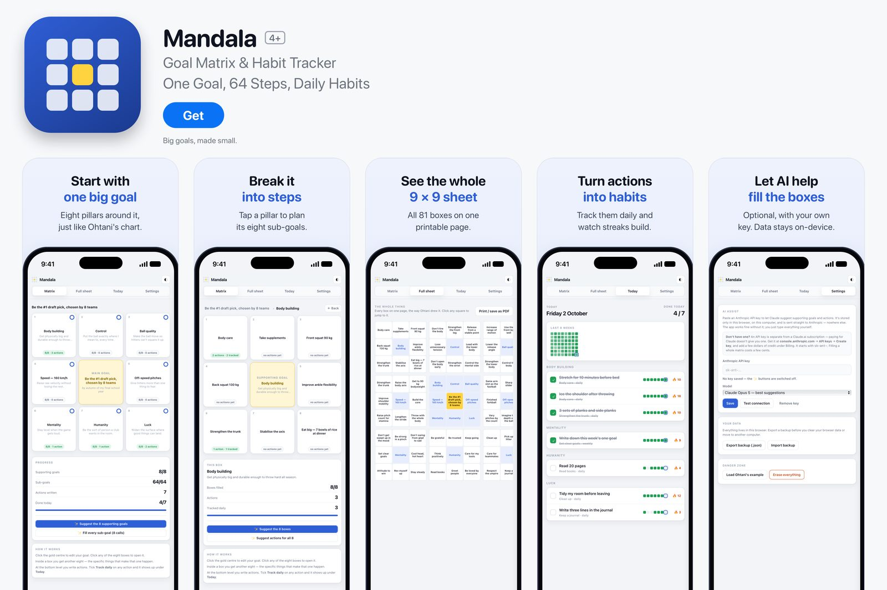

# Mandala: Goal Matrix

A goal-setting web app built around the 9×9 mandala chart, the method Shohei Ohtani used in high school: one central goal, eight supporting goals, and eight actions for each.

## Features

- **Matrix:** fill in the central goal, its sub-goals and their actions
- **Today:** track the actions you are working on as daily habits, with streaks
- **Full sheet:** the whole chart on one page, ready to print
- Export and import your chart as a file
- Optional AI suggestions: add your own Claude API key and it proposes supporting goals and actions. The key is stored only in your browser

## Tech

A single HTML file with vanilla JavaScript and CSS. No dependencies, no build step, no account: data is saved in the browser with `localStorage`. The optional suggestions call the Claude API directly from the browser.

## Running it

Open `index.html` in a browser.
